# Calor vs Humor

A base de dados trata de uma pesquisa com o tema _"Calor vs Humor"_, que analisa como a percepção do calor pode influenciar o humor das pessoas.

## Preparando o ambiente de execução

```markdown
📁 Projeto Ciência de Dados
├── 📁 src
│ └── 📁 dataset
| └── 📁 graficos
| └── 📁 tabelas
├── 📄 computacao_aplicada.ipynb
├── 📄 README.md
└── 📄 requirements.txt
```

Como visto no esquema acima, o dataset, em formato _"csv"_, pode ser encontrado em [./src/dataset](./src/dataset). Os gráficos vistos neste README são carregados automaticamente após executar o arquivo _"computacao_Aplicada.ipynb"_ e estes podem ser encontrados em [./src/graficos](./src/graficos/). A pasta _"tabelas"_ não é atualizada após a execução do arquivo. A execução do arquivo jupyter notebook depende desse arquivo, o que o torna importante na execução. Além deste, pode-se encontrar o arquivo _"requirements.txt"_ necessário para a instalação de todas as bibliotecas utilizada no projeto.

### Configurando o ambiente de execução

Para configurar o ambiente de execução do código deste repositório, é necessário ter o python na versão igual ou superior a 3.13, além de ter o gerenciador de pacotes do python instalado (pip).

Logo em seguida, utilize o comando `python -m venv venv` para criar um ambiente de execução específico para esta aplicação. Para executar este ambiente, utilize o comando `.\venv\Scripts\activate` pelo próprio terminal ou powershel do windows. Em qualquer momento você pode desativar esse ambiente utilizando o comando `.\venv\Scripts\deactivate`.

> **Lembrando que o usuário deve estar na pasta raiz.**

Com o ambiente de execução devidamente configurado, o próximo passo é instalar as bibliotecas utilizadas no projeto e para isso basta usar o comando `pip intall -r requirements.txt` na raiz deste repositório. Todas as bibliotecas, como numpy, matplotlib, seaborn e outros, serão instalada.

# Metodologias Utilizadas

1. [Pré-processamento de dados (datageeks)](https://www.datageeks.com.br/pre-processamento-de-dados/) e tratamento de dados: limpando dados ausentes e tratando os tipos de dados de cada coluna.
<div align="center"> 
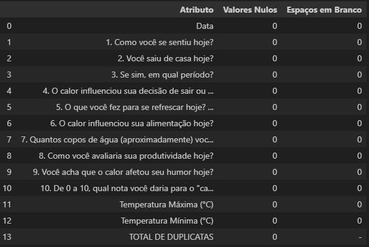
<p>Figura 1: Resultado do pré processamento de dados</p>
</div>

> Vale ressaltar que o dataset não prevê dados duplicados, uma vez que não está sendo coletado dados sensíveis comumentes usados para identificar unicamente uma pessoa.

<div align="center"> 
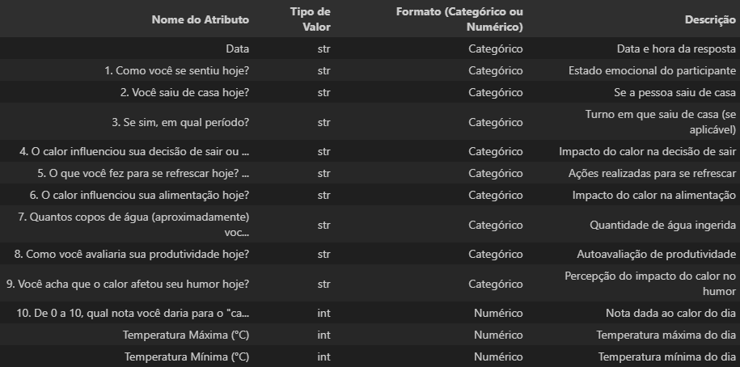
<p>Figura 2: Tipo das colunas</p>
</div>

    Como visto na figura 2, o dataset é cheio de dados categóricos para facilitar na tomada de decisão sem haver complexidade adicional.

2. [Análise exploratória de dados (IBM)](https://www.ibm.com/br-pt/think/topics/exploratory-data-analysis)

# Efetuando análises

Antes de começar a analisar as respostas, vale a pena analisar a frequencia com que as pessoas responderam o formulario.

<div align="center"> 
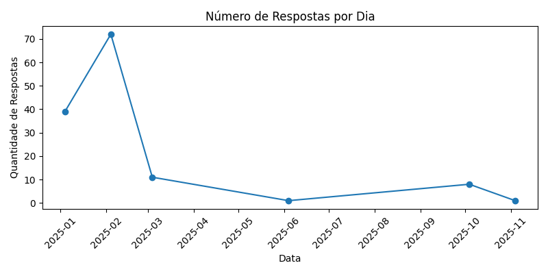
<p>Figura 3: Quantidade de respostas coletadas por dia.</p>
</div>

## Sobre o Formulário

O formulario (Google Forms) tinha 10 questões objetivas. Este foi amplamente divulgado em grupos de alunos, eventos vinculados à UFPI e, também, em redes de contatos pessoais dos participantes. Como resultado, foi gerado um dataset de 132 respostas com 11 colunas (a data em que a pessoa respondeu o questionário e as questões). Posteriormente foi acrescentado as colunas de Temperatura Minima e Máxima em °C. Tais perguntas são:

1. Como você se sentiu hoje?
2. Você saiu de casa hoje?
3. Se sim, em qual período?
4. O calor influenciou sua decisão de sair ou ficar em casa?
5. O que você fez para se refrescar hoje?(Marque todas as que se aplicam)
6. O calor influenciou sua alimentação hoje?
7. Quantos copos de água (aproximadamente) você tomou hoje?
8. Como você avaliaria sua produtividade hoje?
9. Você acha que o calor afetou seu humor hoje?
10. De 0 a 10, qual nota você daria para o "calor de hoje"?

## Análise exploratória com foco em motivação

Esse estudo é importante para descobrir se a temperatura afeta negativamente o cotidiano das pessoas. Sendo assim, é avaliado o bem estar da pessoa juntamente com a ação de sair para fazer algo do cotidiano.

<div align="center"> 
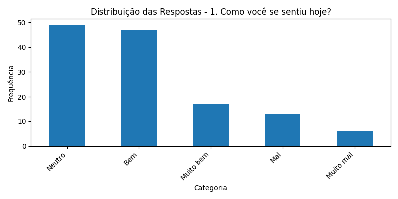
<p>Figura 4: Bem estar pessoal.</p>
</div>

<div align="center"> 
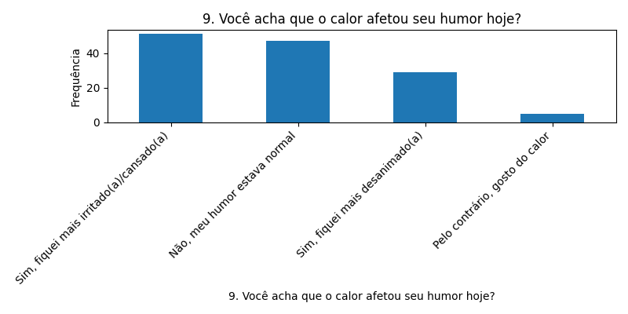
<p>Figura 5: Como o calor afetou o humor das pessoas de Teresina.</p>
</div>

<div align="center"> 
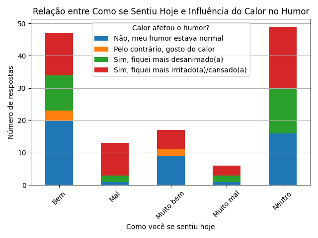
<p>Figura 6: Influência do calor sob o humor</p>
</div>

Com as 3 imagens dá para notar que de fato o calor pode ter influênciado o humor das pessoas. Isso porque uma grande quantidade de pessoas, que se sentiram "mal", "muito mal" ou "neutro", afirmaram que o calor afetou seu humor, não importando se muito ou pouco. Além disso, pode-se notar que poucas pessoas, que afirmam gostar de calor, estão dentro da categoria "bem" e "muito bem".

Este dataset pode ser usado, também, para alimentar aplicações focadas em prevêr e evitar acidentes de trânsito. Se for analisado o temperamento das pessoas com base no calor, quantas pessoas saem de casa se sentindo mal (de forma genérica)?

<div align="center"> 
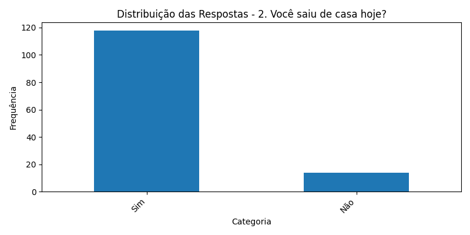
<p>Figura 7: Relação entre as pessoas que saem ou não de casa.</p>
</div>

<div align="center"> 
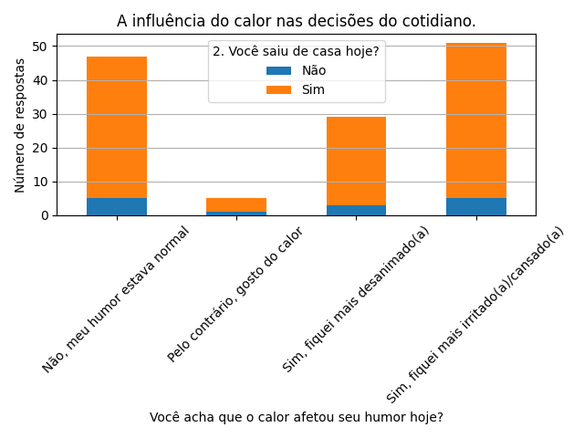
<p>Figura 8: Relação entre as pessoas que saem ou não de casa ao se sentir bem ou mal.</p>
</div>

Analisando os gráficos da figura 4 e 7, que resultaram no gráfico 8, pode ser afirmado, com precisão, que as pessoas não deixam de ir para seus compromissoes mesmo estando se sentindo mal. Em contra partida, elas podem cometer erros no caminho até seu destino. Isso pode ser visto no cotidiano, principalmente no trânsito, quando as pessoas deixam de respeitar as leis de trânsito ao ultrapassar sinais vermelhos, subir canteiros, desrespeitar pedrestes, movimentar-se nas ruas sem sinalizar etc.

## Análise exploratória com foco na temperatura

Não houve sérias mudanças climáticas nos dias em que os participantes responderam o questionário. Tal afirmação pode ser comprovada na figura 9 que mostrar a temperatura, em °C, nos dias que foi registrado ao menos uma resposta.

<div align="center"> 
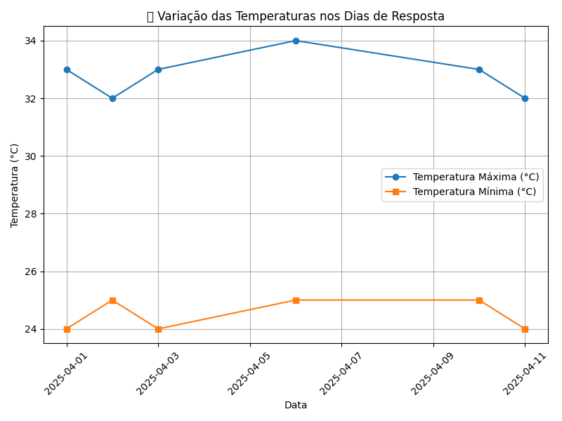
<p>Figura 9: Variação da Temperatura, min e max, nos dias que houve o registro de ao menos uma resposta.</p>
</div>

A figura 10 é resultado do redirecionamento do estudo para as pessoas que responderam o formulário e analisando a nota que elas deram para a temperatuda do dia. Tais dados são melhores vistos na figura11 que mostrar a distribuição de notas do calor.

<div align="center"> 
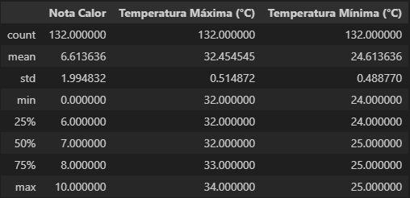
<p>Figura 10: Resultados retirados da análise dos dados vista na figura 9</p>
</div>

<div align="center"> 
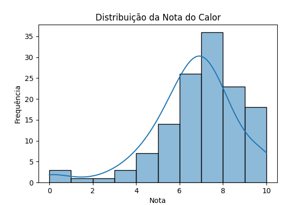
<p>Figura 11: Distribuição da nota do calor</p>
</div>

<div align="center"> 
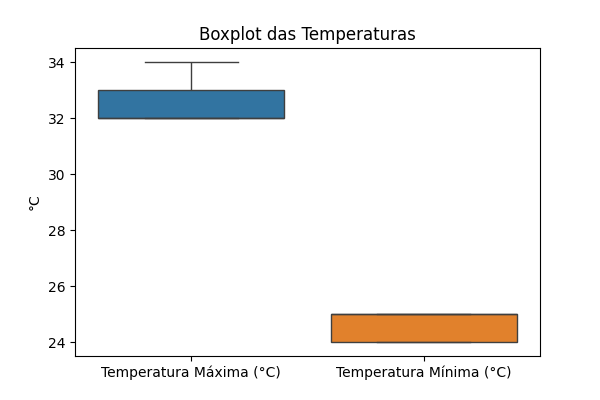
<p>Figura 12: Boxplot das temperaturas</p>
</div>

O gráfico, visto na figura 12, mostra que a temperatura estava estável, ou seja, não alternou muito durante os dias em que foram registrado respostas no formulário. A temperatura máxima gira em torno de 33 a 34°C com mediana próxima de 22,5°C enquanto a temperatura minima gira em torno de 24 a 25°C com mediana em torno de 24,5°C.

<div align="center"> 
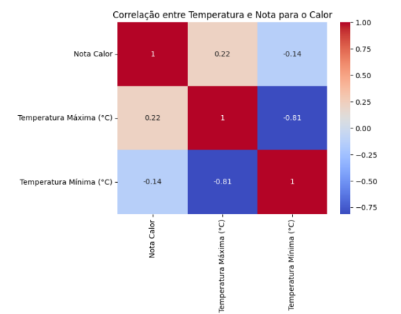
<p>Figura 13: Mapa de calor correção entre Temperatura e Nota de Calor</p>
</div>

Neste mapa de calor, visualizamos a correlação entre a nota do calor, a temperatura máxima e a temperatura mínima. A intensidade da cor indica a força e a direção da relação. Podemos observar, por exemplo, que há uma correlação positiva entre a nota do calor e a temperatura máxima, e uma correlação negativa entre a nota do calor e a temperatura mínima. Além disso, as temperaturas máxima e mínima têm uma alta correlação positiva entre si.

<div align="center"> 
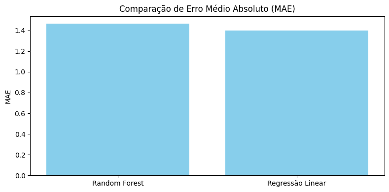
<p>Figura 14: Gráfico de Erro Médio Absoluto (MAE) </p>
</div>

Os modelos foram comparados usando o Erro Médio Absoluto (MAE). O MAE indica a média das diferenças absolutas entre os valores previstos e os valores reais. Um MAE menor indica um melhor desempenho. Podemos observar que ambos os modelos apresentaram valores de MAE bastante próximos, sugerindo uma performance similar em termos de erro absoluto.

<div align="center"> 
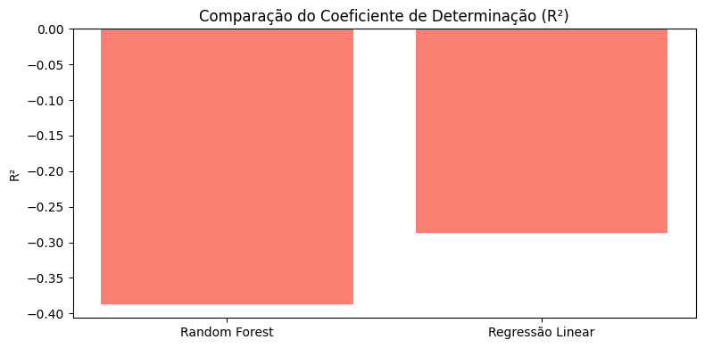
<p>Figura 15: Gráfico com o Coeficiente de Determinação (R²)</p>
</div>

Por fim, comparamos os modelos utilizando o Coeficiente de Determinação (R²). O R² mede a proporção da variância na variável dependente que é previsível a partir das variáveis independentes. Valores de R² próximos de 1 indicam que o modelo explica bem a variabilidade dos dados. Neste caso, os valores de R² são negativos e baixos para ambos os modelos, sugerindo que nenhum deles foi capaz de explicar de forma significativa a variância da nota de calor com base nas variáveis utilizadas.
